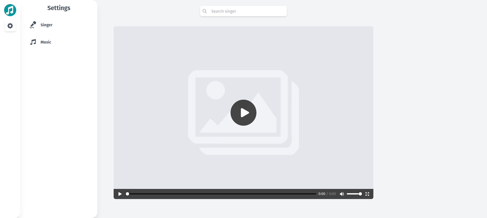

# MV-Player
Mv Player is an app that used to listen to music while managing it. Currently, it is only support .webm format.

---

## Requirement
PHP version 7.3 or higher is required, with the following extensions installed:

- [intl](http://php.net/manual/en/intl.requirements.php)
- [libcurl](http://php.net/manual/en/curl.requirements.php) if you plan to use the HTTP\CURLRequest library

Additionally, make sure that the following extensions are enabled in your PHP:

- json (enabled by default - don't turn it off)
- [mbstring](http://php.net/manual/en/mbstring.installation.php)
- [mysqlnd](http://php.net/manual/en/mysqlnd.install.php)
- xml (enabled by default - don't turn it off)

---

## Setup
- Clone this repo to your desktop.
- Run `composer install`.

---

## Usage
Run `php spark serve` to start the application. You will then be able to access it at localhost:8080.

---

## Stack
It is created using those amazing technologies:
- [Alpine](https://alpinejs.dev/)
- [Tailwind](https://tailwindcss.com/)
- [CodeIgniter](https://codeigniter.com/)
- And many others!

---

## License
>You can check out the full license [here](https://github.com/hafizhaziq307/MV-Player/blob/main/LICENSE)

This project is licensed under the terms of the **MIT** license.